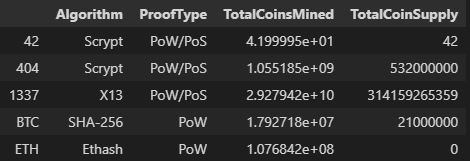
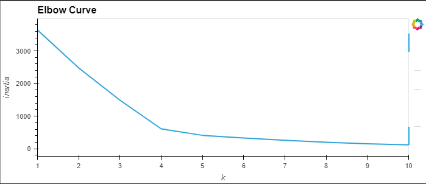
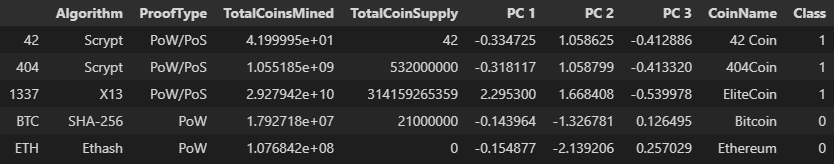
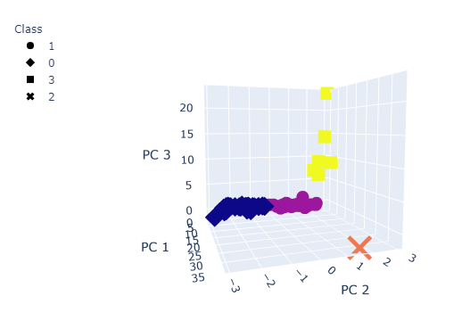
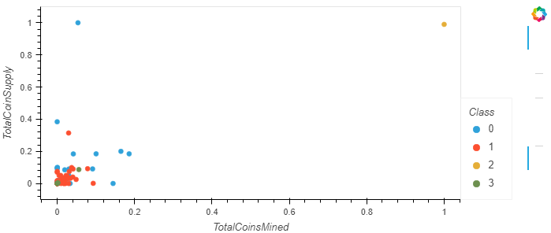

# Cryptocurrencies Analysis

## Project Overview
The main purpose of this project is to create a thorough analysis of cryptocurrency data for clients who are willing to invest into the crypto market. The cryptocurrency data will be grouped together and visualized to help classify and understand the different types of cryptocurrencies on the market. For this analysis, a deep understanding of unsupervised machine learning and its different algorithms will help guide us through this analysis.

## Resources
- Software: 
	- Python 3.7.10
	- Jupyter Notebook
	- Pandas Library
	- sklearn Library
	- plotly Library
- Resources:
	- resources/crypto_data.csv

## Analysis and Results

The first step to any form of data analysis, is to first load in the data, and clean it up. We first filter the data by grabbing only the cryptocurrencies that are currently being traded, have working algorithms, and have some mined coins. Then we remove any unnecessary columns and any rows that have null values. We then have our cleaned dataframe:

After the initial processing of the data, we can begin our analysis. Since the ML algorithms we will be using can't process strings, we will use the pd.get_dummies() method to generate integer replacement values for the two string columns.

Next we will scale the data using the StandardScaler() method. This will scale and center the data (mean=0 and max variance=1).

Then, we will reduce the number of different features from 4, down to 3 principal components using PCA (principal component analysis)

Finally, we can run our algorithm, K-Means. The K-Means algorithm is a type of unsupervised machine learning algorithm that will help us identify and choose how many clusters our data will fit into. First need to find out how many clusters we want for our data. We can guess using trial and error, but we will use an elbow curve here:

Here we can see a clean bend in the curve at both k = 4 and 5. It is up the the user at this point, so here I will choose 4 as it has a much more noticeable bend.

After running the algorithm again with our clusters set to 4, we then put all of our data into a single dataframe:

Using this dataframe, we can use the plotly library to plot a 3d scatter plot of the data:  
  

To better visualize our different types of cryptocurrencies, we will scale the data using the MinMaxScaler() method, and plot it on the regular scatter plot using hvplot:

## Summary

Using unsupervised machine learning, we can cluster our data into different classes, each with their own distinct set of parameters that make them unique. Unfortunately, these algorithms won't directly tell us any insightful truths about the data. Rather, it is up to the user to draw conclusions from the visualizations and data that come from running these ML algorthms. Hopefully, these findings will be useful for those hoping to invest in the cryptocurrency market.